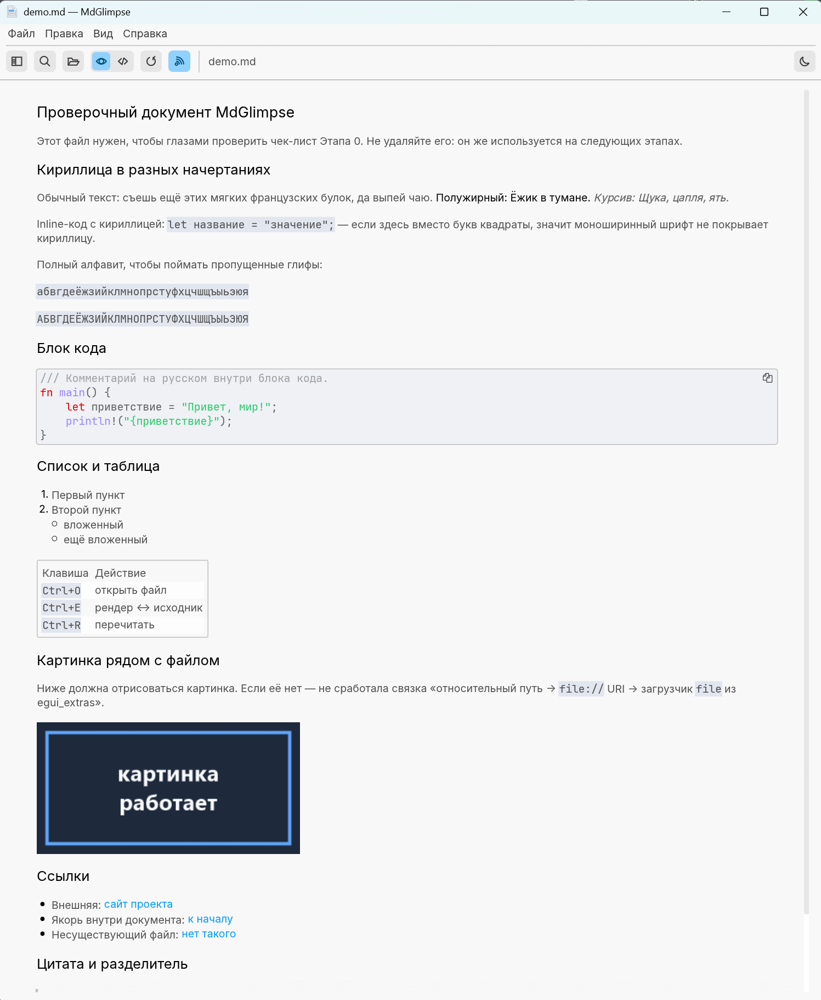
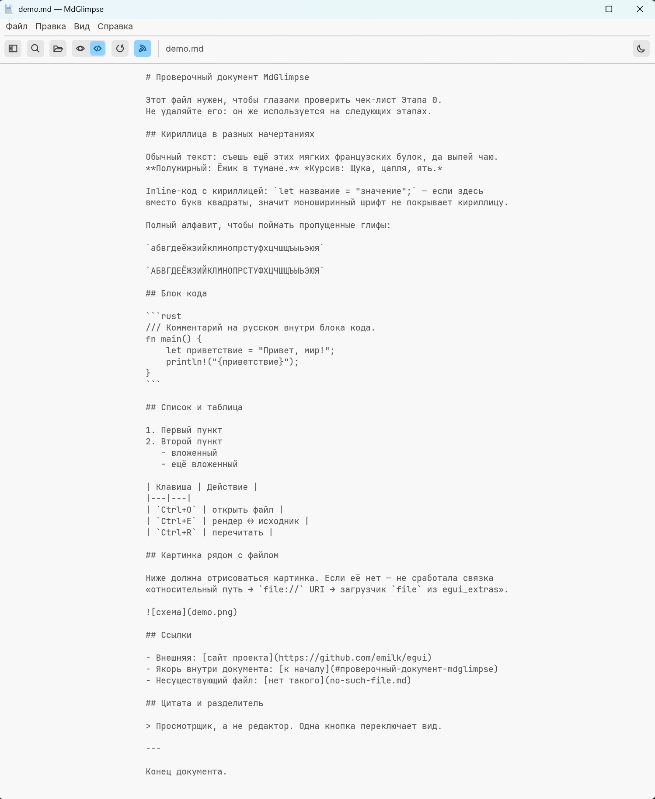
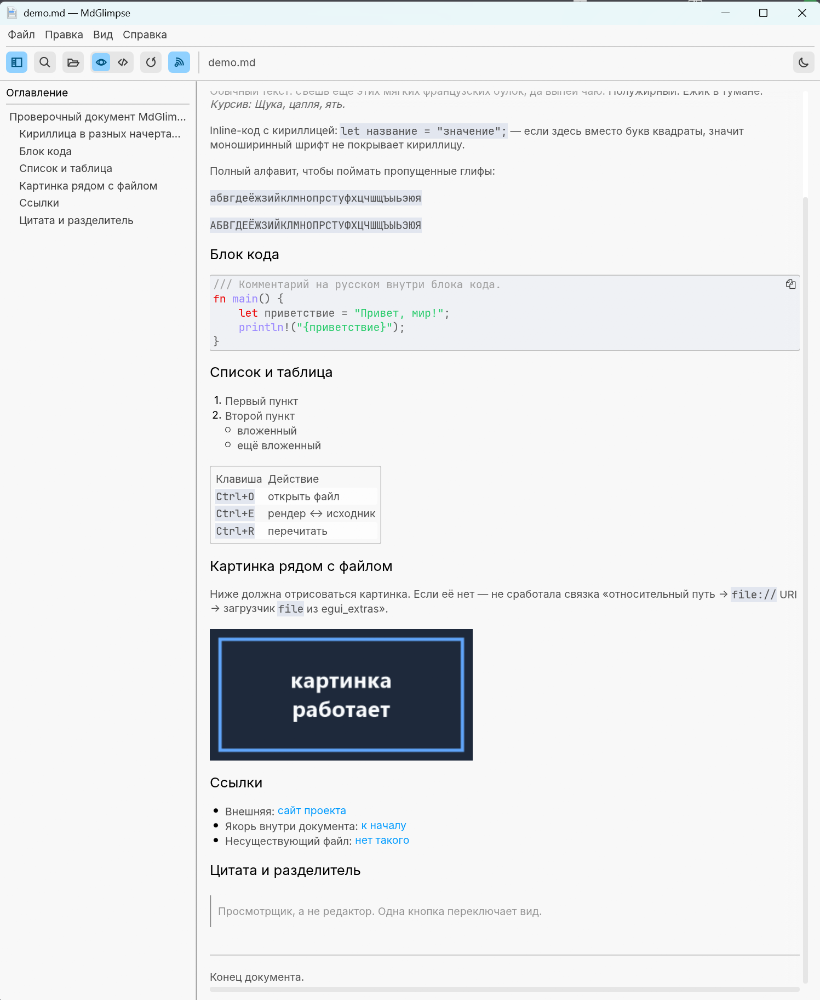
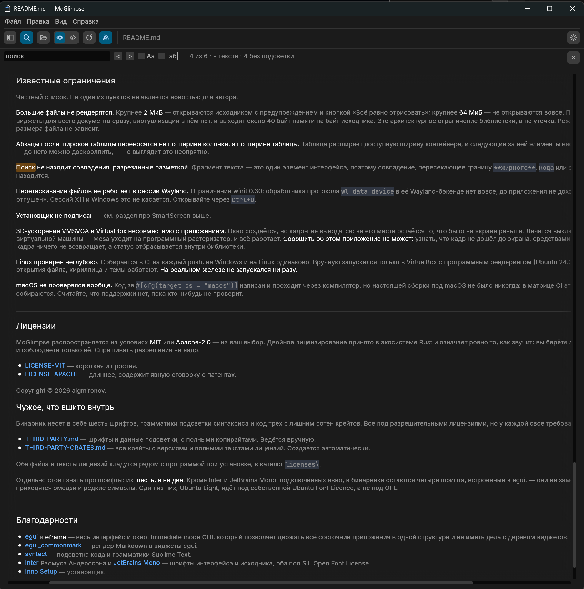

# MdGlimpse

[](https://github.com/algmironov/MdGlimpse/actions/workflows/ci.yml)

Настольный просмотрщик Markdown: открыл файл — увидел, как он выглядит.
Одна кнопка переключает отрендеренный вид и исходный текст. Без рекламы,
без встроенного браузера, без учётной записи — один самодостаточный
исполняемый файл.

**Это просмотрщик, а не редактор.** Править текст и сохранять `.md`
MdGlimpse не умеет и уметь не будет: если вам нужен редактор, вам нужна
другая программа. Windows и Linux.

---

## Как выглядит

| | |
|---|---|
|  |  |
| Рендер | Исходник — та же кнопка, `Ctrl+E` |
|  |  |
| Оглавление документа, `Ctrl+B` | Поиск с подсветкой, `Ctrl+F` |

---

## Что умеет

- **Рендер и исходник по одной кнопке** — `Ctrl+E` или переключатель
  в панели инструментов.
- **Подсветка кода** в огороженных блоках — 75 языков.
- **Оглавление** по заголовкам документа, с переходом по щелчку
  и подсветкой текущего раздела.
- **Поиск по документу** с подсветкой совпадений в обоих режимах.
- **Картинки** рядом с файлом и по абсолютным путям.
- **Слежение за файлом**: правите в другом редакторе — окно обновляется само.
- **Открытие двойным щелчком** по `.md` после добавления в «Открыть
  с помощью» — отдельным действием, не втихую.
- **Светлая и тёмная темы**.
- **Кириллица** во всех начертаниях, включая моноширинное.
- **Недавние файлы**, ширина панелей и прочее состояние переживают
  перезапуск.

Открываются не только `.md`: любой текстовый файл покажется исходником.
Бинарные не открываются вовсе — см. «Известные ограничения».

---

## Установка

Готовые сборки — на странице
[Releases](https://github.com/algmironov/MdGlimpse/releases).

| Файл | Кому |
|---|---|
| `mdglimpse-X.Y.Z-setup.exe` | Windows, обычный путь. Ярлык в «Пуск», отдельной галкой — пункт в «Открыть с помощью» для `.md`. Права администратора не нужны: ставится в `%LOCALAPPDATA%\MdGlimpse`. |
| `mdglimpse-X.Y.Z-windows-x64.exe` | Windows без установки. Один файл, положить куда угодно и запустить. |
| `mdglimpse-X.Y.Z-linux-x64.tar.gz` | Linux x86-64, glibc. |

### Windows покажет предупреждение, и это ожидаемо

Установщик не подписан сертификатом издателя. При запуске Windows покажет
синее окно «Система Windows защитила ваш компьютер», и кнопки «Выполнить»
на нём сразу не будет.

**Что нажимать:** «Подробнее» → «Выполнить в любом случае».

Так происходит с любой неподписанной программой. SmartScreen не заглядывает
внутрь файла и не находит там ничего плохого — он проверяет репутацию:
кто издатель и часто ли этот файл уже скачивали. У файла без подписи
издателя нет, а у свежего релиза нет и статистики загрузок, поэтому ответ
всегда одинаковый — и для этого установщика, и для любого другого.

Подпись здесь не появится в обозримом будущем: сертификат стоит денег
и требует ежегодного продления, а проект некоммерческий. Самоподписанный
сертификат ставить бессмысленно — SmartScreen он не успокаивает, а вопросов
у человека прибавляет.

### Сверка контрольной суммы

Вместо подписи — SHA-256. Она позволяет убедиться, что скачанный файл ровно
тот, который собрал GitHub Actions, а не подменённый или битый. Суммы
перечислены в описании релиза и лежат рядом с ним в `SHA256SUMS.txt`:

```powershell
Get-FileHash .\mdglimpse-X.Y.Z-setup.exe -Algorithm SHA256
```

```bash
sha256sum -c SHA256SUMS.txt
```

Те же суммы печатает лог сборки в
[Actions](https://github.com/algmironov/MdGlimpse/actions). Он публичный,
и сверяться лучше с ним: описание релиза лежит на той же странице, что
и сам файл, а лог прогона — независимый источник.

---

## Сборка из исходников

Нужен Rust ≥ 1.95 (`rustup update`).

```bash
cargo run --release -- путь/к/файлу.md
```

Проверить, что всё работает, можно на вложенном примере — в нём кириллица
во всех начертаниях, блок кода, таблица и картинка рядом с файлом:

```bash
cargo run --release -- samples/demo.md
```

Первая сборка займёт несколько минут: `syntect` (подсветка кода) тянет
много кода. Если подсветка не нужна — уберите `better_syntax_highlighting`
из `Cargo.toml`, сборка станет заметно быстрее, а бинарник меньше.

**Windows** — ничего дополнительно не нужно, MSVC toolchain и всё.

**Linux — системные заголовки** (Debian/Ubuntu):

```bash
sudo apt install build-essential pkg-config \
    libx11-dev libxcursor-dev libxrandr-dev libxi-dev \
    libgl1-mesa-dev libxkbcommon-dev libwayland-dev
```

Диалог открытия файла идёт через XDG Desktop Portal (D-Bus) — на любом
современном рабочем столе работает без доп. пакетов. Если портал
не заводится, есть запасной путь через GTK:

```toml
rfd = { version = "0.17", default-features = false, features = ["gtk3"] }
```

### Установщик (Windows)

Нужен [Inno Setup 6](https://jrsoftware.org/isinfo.php) —
`winget install -e --id JRSoftware.InnoSetup`.

```powershell
cargo build --release
iscc installer\mdglimpse.iss
```

Готовый файл появится в `installer\output\`. Номер версии установщик берёт
из метаданных собранного `.exe`, а те — из `Cargo.toml`; руками его нигде
указывать не надо. Имя при этом получится с четырьмя числами
(`mdglimpse-0.1.0.0-setup.exe`), потому что версия приходит в формате
VersionInfo. Релизная сборка приводит имя к тегу ключом `/F`, и то же можно
сделать руками:

```powershell
iscc /Fmdglimpse-0.1.0-setup installer\mdglimpse.iss
```

Установщик кладёт рядом с программой оба файла уведомлений и каталог
`licenses\` с текстами всех лицензий. Если `THIRD-PARTY-CRATES.md`
не сгенерирован, компиляция установщика остановится с ошибкой — так
задумано, см. ниже.

### Список лицензий зависимостей

`THIRD-PARTY-CRATES.md` создаётся автоматически и коммитится в репозиторий:
установщик берёт его из рабочего дерева, а релизный workflow генератор
не ставит. Перегенерировать надо при **любом** изменении `Cargo.lock`:

```bash
cargo install cargo-about --locked --features cli
cargo about generate --fail --locked -o THIRD-PARTY-CRATES.md about.hbs
```

Фича `cli` обязательна: без неё cargo-about собирается как библиотека
и никакой команды не появляется. `--fail` не даёт неопознанной лицензии
молча превратиться в дырку в отчёте, `--locked` требует ровно тот набор
версий, из которого собирается релиз. Настройки — в `about.toml`,
оформление — в `about.hbs`.

Второй файл, `THIRD-PARTY.md`, ведётся **вручную**: в нём шрифты и данные
подсветки синтаксиса, которых cargo-about не видит в принципе — он читает
`Cargo.toml`, а они лежат внутри крейтов как байты. Перегенерация его
не трогает, потому что пишет в другое имя.

### Проверки перед коммитом

```bash
cargo fmt --check
cargo clippy --all-targets -- -D warnings
cargo test
cargo build --release
cargo tree -d          # не должно быть дубликатов egui
```

Те же проверки гоняет CI на Windows и Linux при каждом push и pull request.
Тест регистрации в реестре помечен `#[ignore]` и в CI не запускается: он
пишет в `HKCU` того, кто его запустил.

**Как выпустить версию:** поднять `version` в `Cargo.toml`, закоммитить,
`git tag v1.2.3 && git push origin v1.2.3`. Первый шаг release-workflow
сверяет тег с версией в `Cargo.toml` и падает при расхождении, ещё
до сборки. Результат — черновик релиза, публикуется руками.

---

## Горячие клавиши

| | |
|---|---|
| `Ctrl+O` | открыть файл |
| `Ctrl+E` | рендер ↔ исходник (то же делает переключатель 👁 / `</>` в панели) |
| `Ctrl+R` | перечитать с диска |
| `Ctrl+B` | боковая панель с оглавлением |
| `Ctrl+F` | поиск; `F3` / `Shift+F3` — следующее и предыдущее, `Esc` — закрыть |
| `Ctrl+A` | выделить весь документ |
| `Ctrl+C` | скопировать выделенное, а без выделения — документ целиком |
| `Ctrl` + `+` / `−` / `0` | масштаб |
| `Shift` + колесо | горизонтальная прокрутка |
| перетаскивание файла в окно | открыть (кроме сессии Wayland, см. ограничения) |

Галка «Следить за файлом» перечитывает его при изменении на диске —
удобно, если правите в другом редакторе рядом.

---

## Ассоциация с `.md`

«Файл» → «Добавить в „Открыть с помощью“». Пишется только
в `HKCU\Software\Classes`, прав администратора не нужно, при запуске
программа в реестр не лезет — ассоциация появляется исключительно
по нажатию этого пункта. «Убрать из „Открыть с помощью“» удаляет ровно
своё: дерево `MdGlimpse.markdown` целиком и **только своё значение**
из `OpenWithProgids`, потому что в этом ключе перечислены и чужие программы.

**Стать обработчиком по умолчанию программа не может, и это не недоделка.**
С Windows 8 ключ `UserChoice` защищён хешем от пути, расширения и SID
пользователя; алгоритм не документирован, а подделка хеша — ровно то,
против чего защиту и вводили. Поэтому двойной щелчок по `.md` начнёт
открывать MdGlimpse только после того, как вы сами выберете его
в «Открыть с помощью» и отметите «Всегда использовать».

Под Linux то же действие пишет `.desktop` в `$XDG_DATA_HOME/applications`
и зовёт `xdg-mime default` для `text/markdown`. Код написан, но на живой
системе не проверялся. Под macOS ассоциации живут в `Info.plist` внутри
`.app`-бандла, кнопкой это не делается — там пункт меню честно недоступен.

---

## Что открывается, а что нет

Открываются любые текстовые файлы, не только markdown. `.toml`, `.txt`,
`.rs` и прочее показывается сразу исходником — рендерить `Cargo.toml`
как markdown бессмысленно.

**Бинарные файлы не открываются.** Первые 8 КБ проверяются на нулевой байт
и на долю управляющих символов; `.exe` и картинки отсеиваются с понятным
сообщением, а ранее открытый документ не теряется. Текст в чужой
восьмибитной кодировке (CP1251 и подобные) при этом остаётся читаемым:
пороги подобраны так, чтобы его не задеть.

---

## Известные ограничения

Честный список. Ни один из пунктов не является новостью для автора.

**Большие файлы не рендерятся.** Крупнее **2 МиБ** — открываются исходником
с предупреждением и кнопкой «Всё равно отрисовать»; крупнее **64 МиБ** —
не открываются вовсе. Причина в `egui_commonmark`: он строит виджеты для
всего документа сразу, виртуализации в нём нет, и выходит около 40 байт
памяти на байт исходника. Это архитектурное ограничение библиотеки, а не
утечка. Режим «Исходник» виртуализирован и от размера файла не зависит.

**Абзацы после широкой таблицы переносятся не по ширине колонки,
а по ширине таблицы.** Таблица расширяет доступную ширину контейнера,
и следующие за ней элементы наследуют увеличенную. Текст не теряется —
до него можно доскроллить, — но выглядит это неопрятно.

**Поиск не находит совпадения, разрезанные разметкой.** Фрагмент текста —
это один элемент интерфейса, поэтому совпадение, пересекающее границу
`**жирного**`, `кода` или ссылки, распадается на два куска и не находится.

**Перетаскивание файлов не работает в сессии Wayland.** Ограничение winit
0.30: обработчика протокола `wl_data_device` в её Wayland-бэкенде нет
вовсе, до приложения не доходит ни «файл над окном», ни «файл отпущен».
Сессий X11 и Windows это не касается. Открывайте через `Ctrl+O`.

**Установщик не подписан** — см. раздел про SmartScreen выше.

**3D-ускорение VMSVGA в VirtualBox несовместимо с приложением.** Окно
создаётся, но кадры не выводятся: на его месте остаётся то, что было
на экране раньше. Лечится выключением 3D-ускорения в настройках
виртуальной машины — Mesa уходит на программный растеризатор, и всё
работает. **Сообщить об этом приложение не может:** узнать, что кадр
не дошёл до экрана, средствами eframe и wgpu нельзя — функция вывода кадра
ничего не возвращает, а статус отбрасывается внутри библиотеки.

**Linux проверен неглубоко.** Собирается в CI на каждый push, на Windows
и на Linux одинаково. Вручную запускался только в VirtualBox с программным
рендерингом (Ubuntu 24.04): меню, оглавление, поиск, диалог открытия файла,
кириллица и темы работают. **На реальном железе не запускался ни разу.**

**macOS не проверялся вообще.** Код за `#[cfg(target_os = "macos")]`
написан и проходит через компилятор, но настоящей сборки под macOS не было
никогда: в матрице CI этой платформы нет, релизы под неё не собираются.
Считайте, что поддержки нет, пока кто-нибудь не проверит.

---

## Лицензии

MdGlimpse распространяется на условиях **MIT** или **Apache-2.0** —
на ваш выбор. Двойное лицензирование принято в экосистеме Rust и означает
ровно то, как звучит: вы берёте **любую одну** из двух, ту, что вам удобнее,
и соблюдаете только её. Спрашивать разрешения не надо.

- [LICENSE-MIT](LICENSE-MIT) — короткая и простая.
- [LICENSE-APACHE](LICENSE-APACHE) — длиннее, содержит явную оговорку
  о патентах.

Copyright © 2026 algmironov.

### Чужое, что вшито внутрь

Бинарник несёт в себе шесть шрифтов, грамматики подсветки синтаксиса и код
трёх с лишним сотен крейтов. Все под разрешительными лицензиями, но у каждой
своё требование к уведомлениям:

- [THIRD-PARTY.md](THIRD-PARTY.md) — шрифты и данные подсветки, с полными
  копирайтами. Ведётся вручную.
- [THIRD-PARTY-CRATES.md](THIRD-PARTY-CRATES.md) — все крейты с версиями
  и полными текстами лицензий. Создаётся автоматически.

Оба файла и тексты лицензий кладутся рядом с программой при установке,
в каталог `licenses\`.

Отдельно стоит знать про шрифты: их **шесть, а не два**. Кроме Inter
и JetBrains Mono, подключённых явно, в бинарнике остаются четыре шрифта,
встроенные в egui, — они не заменяются, а служат запасными, и на них
приходятся эмодзи и редкие символы. Один из них, Ubuntu Light, идёт под
собственной Ubuntu Font Licence, а не под OFL.

---

## Благодарности

- [egui](https://github.com/emilk/egui) и **eframe** — весь интерфейс
  и окно. Immediate mode GUI, который позволяет держать всё состояние
  приложения в одной структуре и не иметь дела с деревом виджетов.
- [egui_commonmark](https://github.com/lampsitter/egui_commonmark) — рендер
  Markdown в виджеты egui.
- [syntect](https://github.com/trishume/syntect) — подсветка кода
  и грамматики Sublime Text.
- [Inter](https://rsms.me/inter/) Расмуса Андерссона и
  [JetBrains Mono](https://www.jetbrains.com/lp/mono/) — шрифты интерфейса
  и исходника, оба под SIL Open Font License.
- [Inno Setup](https://jrsoftware.org/isinfo.php) — установщик.

---

## Ещё

- [NOTES.md](NOTES.md) — разбор мест в коде, где язык или устройство
  библиотеки что-то решают. Для тех, кто читает исходники.
- [ROADMAP.md](ROADMAP.md) — что сделано, что нет и что всплыло по дороге.
