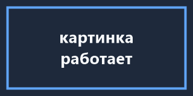

# Проверочный документ mdview

Этот файл нужен, чтобы глазами проверить чек-лист Этапа 0.
Не удаляйте его: он же используется на следующих этапах.

## Кириллица в разных начертаниях

Обычный текст: съешь ещё этих мягких французских булок, да выпей чаю.
**Полужирный: Ёжик в тумане.** *Курсив: Щука, цапля, ять.*

Inline-код с кириллицей: `let название = "значение";` — если здесь
вместо букв квадраты, значит моноширинный шрифт не покрывает кириллицу.

Полный алфавит, чтобы поймать пропущенные глифы:

`абвгдеёжзийклмнопрстуфхцчшщъыьэюя`

`АБВГДЕЁЖЗИЙКЛМНОПРСТУФХЦЧШЩЪЫЬЭЮЯ`

## Блок кода

```rust
/// Комментарий на русском внутри блока кода.
fn main() {
    let приветствие = "Привет, мир!";
    println!("{приветствие}");
}
```

## Список и таблица

1. Первый пункт
2. Второй пункт
   - вложенный
   - ещё вложенный

| Клавиша | Действие |
|---|---|
| `Ctrl+O` | открыть файл |
| `Ctrl+E` | рендер ↔ исходник |
| `Ctrl+R` | перечитать |

## Картинка рядом с файлом

Ниже должна отрисоваться картинка. Если её нет — не сработала связка
«относительный путь → `file://` URI → загрузчик `file` из egui_extras».



## Ссылки

- Внешняя: [сайт проекта](https://github.com/emilk/egui)
- Якорь внутри документа: [к началу](#проверочный-документ-mdview)
- Несуществующий файл: [нет такого](no-such-file.md)

## Цитата и разделитель

> Просмотрщик, а не редактор. Одна кнопка переключает вид.

---

Конец документа.
